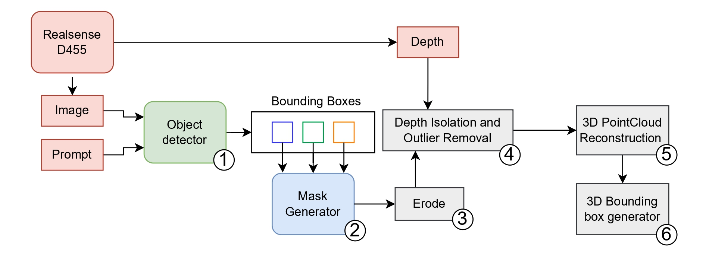

# OpenNav: Efficient Open Vocabulary 3D Object Detection for Smart Wheelchair Navigation
Official code for the OpenNav paper. ACVR Workshop at ECCV'24
The official implementation of the **Twelfth International Workshop on Assistive Computer Vision and Robotics** paper [**OpenNav: Efficient Open Vocabulary 3D Object Detection for Smart Wheelchair Navigation**](https://arxiv.org/abs/2408.13936).



The method is tested for ROS2 Humble on Ubuntu 22.04 with IntelRealsense D455 camera

## Environment setup
Create a new conda environment
```
conda create -n opennav python=3.10
conda activate opennav
```

Install dependencies
```
pip install -r requirements.txt
```

## ROS 2 Installation
To run this project, you first need to install ROS 2 Humble. Follow the instructions below to set up ROS 2 on your system.

### Install ROS 2 Humble and source it

Follow the official ROS 2 installation guide for your operating system. You can find the instructions at [ROS 2 Humble Installation](https://docs.ros.org/en/humble/Installation/).

### Install ROS 2 Packages
```
sudo apt update
sudo apt install python3-colcon-common-extensions
sudo apt install ros-humble-desktop
sudo apt install ros-humble-vision-msgs
sudo apt install ros-humble-cv-bridge
```

After installing, you need to source the ROS 2 setup script to add the ROS 2 commands to your environment:

```
source /opt/ros/humble/setup.bash
```

To make this change permanent, add the line above to your ~/.bashrc file:
```
echo "source /opt/ros/humble/setup.bash" >> ~/.bashrc
source ~/.bashrc
```
### Build Your Workspace

After installing ROS 2 and the required packages, clone the repository of project:
```
git clone https://github.com/EasyWalk-PRIN/OpenNav.git
```
Build the project
```
cd OpenNav
colcon build
source install/setup.bash
```
## Running Node
First, open a terminal and run node for realsense camera
```
ros2 launch realsense2_camera rs_launch.py pointcloud.enable:=true depth_module.profile:=640x480x30 rgb_camera.profile:=640x480x30
```
Launch 3D detection pipeline
```
ros2 launch rl_detect_bringup rl_detect_launch.py
```

For visualization, Open a new terminal with ROS2 sourced and run
```
rviz2
```
## Note
Different Yoloworld models and classes of interest can be specified in
```
src/rl_detect_bringup/launch/rl_detect_launch.py
```

## Citation
```
@article{Rahman2024OpenNavEO,
  title={OpenNav: Efficient Open Vocabulary 3D Object Detection for Smart Wheelchair Navigation},
  author={Muhammad Rameez Ur Rahman and Piero Simonetto and Anna Polato and Francesco Pasti and Luca Tonin and Sebastiano Vascon},
  journal={ArXiv},
  year={2024},
  volume={abs/2408.13936},
  url={https://api.semanticscholar.org/CorpusID:271956865}
}
```
